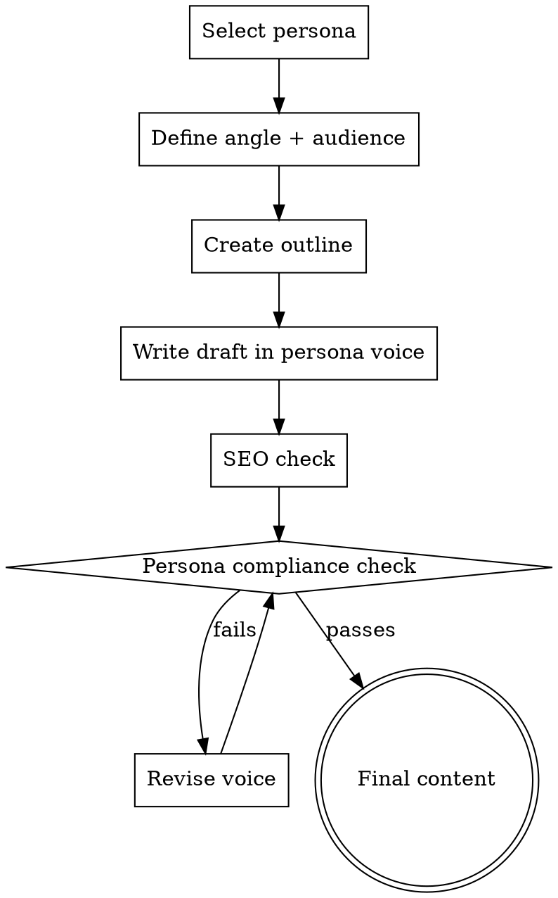

# Content Writer

## Overview

Modular content creation system with **pluggable writing personas**. Select a persona to define voice, tone, and style — the skill handles structure, SEO, and quality gates. Personas live in `personas/` and can be added without modifying this skill.

## When to Use

- Writing blog posts, articles, or editorial content
- Creating news pieces or opinion articles
- Any long-form content that needs a distinct voice
- When the user requests a specific writing style or persona

> **Related:** to authenticate human voice / remove AI-typical patterns in any draft, see `human-voice-writing`; it authenticates voice, it does not override an explicit persona.

## Architecture

```
content-writer/
  SKILL.md                    # This file — orchestrator
  personas/
    jeremy-clarkson.md        # Bold, dramatic, dry humor
    # Add new personas here as .md files
```

**Adding a persona:** Create a new `.md` file in `personas/` following the persona template structure. No changes needed to this file.

## Content Creation Process



### Step 1: Select Persona

Load the requested persona file from `personas/`. If no persona specified, ask the user. Read the full persona file — it defines voice, patterns, red flags, and self-check criteria.

### Step 2: Define Angle + Audience

Before writing a single word, establish:

| Element | Question |
|---------|----------|
| **Angle** | What's the hook? Why should anyone care RIGHT NOW? |
| **Audience** | Who reads this? What do they already know? |
| **Goal** | Inform? Persuade? Entertain? Drive action? |
| **CTA** | What should the reader do after reading? |
| **Key facts** | What data/research supports the piece? |

### Step 3: Create Outline

Structure the piece with the persona's natural rhythm. Every persona file includes structural preferences. General rules:

- **Opening**: Hook within first 2 sentences. No throat-clearing.
- **Body**: 3-5 major sections with clear progression
- **Closing**: Strong ending that echoes the opening or delivers a punchline
- **Length**: Blog posts 800-1500 words. Features 1500-2500 words.

### Step 4: Write in Persona Voice

Follow the persona file exactly. Key rules:

1. **Read the persona's "Voice DNA" section** — these are the non-negotiable style markers
2. **Use the persona's sentence patterns** — rhythm matters more than vocabulary
3. **Apply rhetorical devices** from the persona's toolkit
4. **Check against "Never Do" list** — every persona defines anti-patterns

### Step 5: SEO Integration

Content must serve both readers AND search engines:

| Element | Requirement |
|---------|-------------|
| **Title tag** | Include primary keyword, compelling, <60 chars |
| **Meta description** | Summarise with hook, include keyword, <155 chars |
| **H1** | One per page, includes primary keyword naturally |
| **H2/H3** | Logical hierarchy, keyword variations where natural |
| **Internal links** | Link to relevant products/pages on site (2-5 per post) |
| **Image alt text** | Descriptive, include keyword where relevant |
| **URL slug** | Short, keyword-rich, hyphenated |

**SEO must not break voice.** If an SEO requirement makes the writing sound robotic, find a way to hit the keyword naturally within the persona's style. Never stuff keywords.

### Localisation: UK English

All content defaults to **British English** unless explicitly overridden:

| Rule | Example |
|------|---------|
| **Spelling** | colour, centre, optimise, defence, catalogue, licence (noun) |
| **Currency** | £ (GBP) first, with USD in parentheses if needed for context |
| **Units** | Metric primary. Use miles only for driving distances. |
| **Date format** | DD Month YYYY (e.g., 17 March 2026) — never MM/DD/YYYY |
| **Vocabulary** | boot (not trunk), bonnet (not hood), pavement (not sidewalk), mobile (not cell phone), post (not mail), quid/pounds (not dollars) |
| **Cultural references** | British — Premier League, Nando's, M&S, B&Q, Argos, Currys. Not Walmart, Home Depot, Target. |
| **Tone markers** | "brilliant", "rubbish", "dodgy", "sorted", "mate", "bloke", "proper" |
| **Retail/pricing** | Reference UK retailers (Scan, CCL, Overclockers UK, Currys, Argos, Amazon UK) not US ones (Newegg, Best Buy, Micro Center) |
| **Geography** | UK cities, counties, regions. Reference local context where relevant. |
| **Legal/regulatory** | GDPR, Consumer Rights Act 2015, Distance Selling Regulations — not FTC, FCC. |

**Persona files can override** specific localisation rules (e.g., an American persona would use US English). The persona's localisation takes precedence over these defaults.

### Step 6: Persona Compliance Check

Before finalising, run through the persona's self-check questions. Every persona file includes a "Compliance Checklist" section. The content must pass ALL items.

## Output Format

Deliver content as:

```
## Meta
- **Title tag**: [optimised title]
- **Meta description**: [155 chars max]
- **URL slug**: /blog/[slug]
- **Persona used**: [name]
- **Word count**: [X]
- **Target keyword**: [primary]
- **Secondary keywords**: [list]

## Content

[Full article in HTML-ready format with H2/H3 structure]

## Internal Links Used
- [Link text](URL) — context
```

## Available Personas

| Persona | Style | Best For |
|---------|-------|----------|
| `jeremy-clarkson` | Bold, dramatic, dry British humor, opinionated | Opinion pieces, market commentary, "state of things" articles, rants about pricing/industry |

## Persona File Template

When creating new personas, follow this structure:

```markdown
---
name: persona-name
description: One-line description of voice and best use cases
---

# [Persona Name] Voice

## Voice DNA (Non-Negotiable)
[3-5 core characteristics that MUST be present]

## Sentence Patterns
[How sentences are structured — rhythm, length variation, punctuation]

## Rhetorical Devices
[Specific techniques this persona uses — metaphors, callbacks, rule of three, etc.]

## Vocabulary & Phrasing
[Words/phrases to USE and words/phrases to AVOID]

## Opening Patterns
[How this persona starts articles — with examples]

## Closing Patterns
[How this persona ends articles — with examples]

## Never Do
[Anti-patterns that break the voice]

## Compliance Checklist
[Questions to verify the content sounds like this persona]

## Example Passages
[2-3 short examples showing the voice in action on tech topics]
```

## See also

- `business-writing` — internal and stakeholder writing (email, message, one-pager, proposal,
  status update). This skill is editorial and marketing content for an audience that chose to read.
