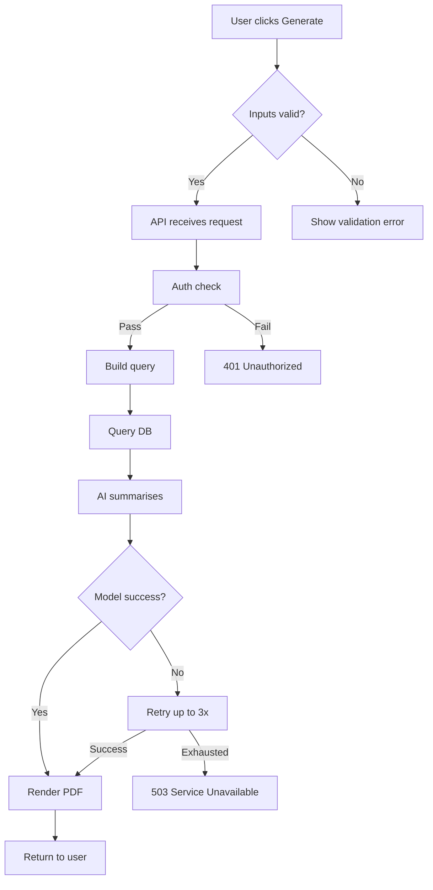
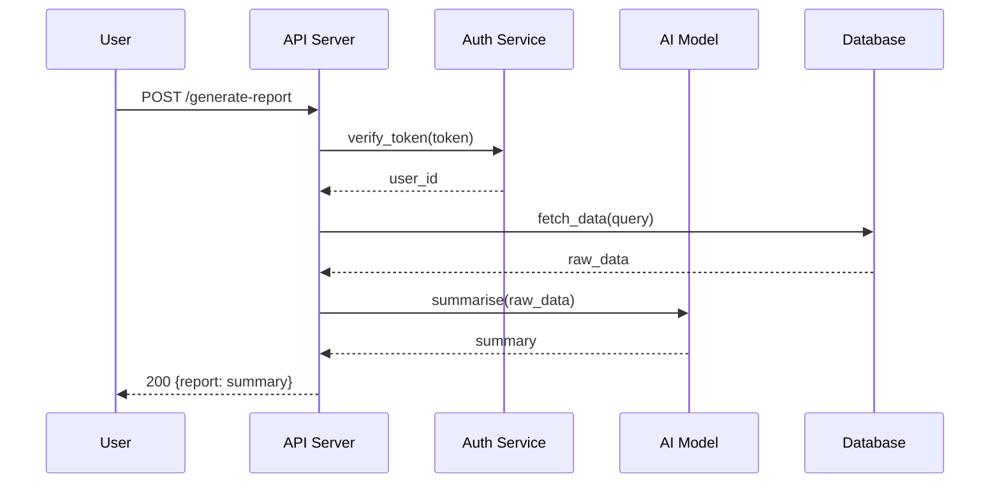
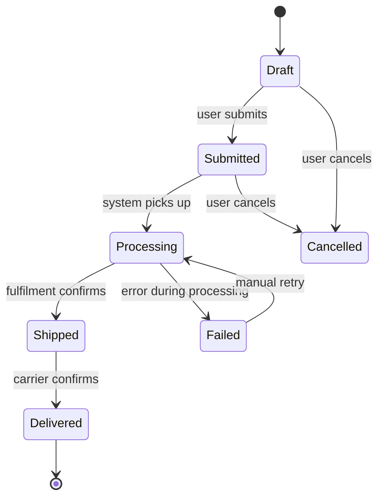

# Flow Diagrams

Reference for `project-documentation`. Templates and conventions for documenting application flows — any chain of actions through the system, whether triggered by a user, scheduler, event, or internal process.

## When to Create Flow Diagrams

| Trigger | Example |
|---------|---------|
| New feature with 3+ steps in sequence | User submits form → validate → AI generates response → format → return |
| Complex component interaction (3+ components) | API → auth → queue → worker → DB → notification |
| Process with decision points or branches | If payment succeeds → fulfill; if fails → retry 3x → alert |
| Entity with 4+ state transitions | Order: draft → submitted → processing → shipped → delivered |
| Scheduled/background process | Cron → fetch external data → transform → store → reconcile |
| Integration between systems | Pull from Jira → map fields → create local task → confirm |
| Error/retry logic that is non-obvious | Retry with backoff → circuit breaker → fallback → dead letter |
| AI/LLM pipeline | Prompt build → model call → parse response → validate → post-process |

**Do NOT create flow diagrams for:**
- Single function calls with obvious behavior
- CRUD operations that follow standard patterns
- Flows already clear from the code (simple request → response)

---

## Flow Types

### User-Initiated

A user action triggers the chain. Document what happens from action to final result.

```
User clicks "Generate Report"
    → frontend validates inputs
    → API receives request
    → auth middleware checks token
    → report service builds query
    → DB returns raw data
    → AI model summarises findings
    → PDF renderer creates document
    → response sent to user
    → notification: "Report ready"
```

### System-Initiated

Scheduler, cron, or timer starts the chain. No user involved.

```
Cron fires daily at 02:00
    → sync service wakes
    → fetch updated tickets from Jira (paginated)
    → for each ticket:
        → map Jira fields to local schema
        → upsert into local DB
        → if status changed: log action
    → write sync summary to sync_state table
    → if errors > threshold: alert via webhook
```

### Event-Driven

External event (webhook, message, signal) triggers processing.

```
Webhook received: payment.completed
    → validate signature
    → parse payload
    → find matching order
    → transition order: processing → paid
    → trigger fulfilment workflow
    → send confirmation email
    → log action
```

### Background Process

Long-running worker, queue consumer, or polling loop.

```
Worker starts → poll queue
    → message received?
        → YES:
            → deserialise payload
            → process item
            → if success: ack message, log result
            → if failure: increment retry count
                → retries < 3? → nack with delay
                → retries >= 3? → move to dead letter queue, alert
        → NO: sleep 5s → poll again
```

### Integration

System-to-system data exchange with transformation.

```
Source: Confluence API
    → pull pages by label "project-docs"
    → for each page:
        → extract task lists from XHTML
        → map to local task schema
        → compare with sync_state (changed?)
            → unchanged: skip
            → changed: update local, log delta
            → new: create local task, add to sync_state
    → update last_synced timestamp
```

---

## Directory Structure

```
docs/flows/
  <type>-<name>.md
```

**Naming convention:** `<type>-<descriptive-name>.md`

| Type prefix | When |
|-------------|------|
| `user-` | User-initiated flows |
| `system-` | Scheduler/cron/timer flows |
| `event-` | Webhook/message/signal flows |
| `worker-` | Background process/queue consumer |
| `integration-` | System-to-system exchange |
| `state-` | Entity state machine |

**Examples:**
```
docs/flows/
  user-generate-report.md
  user-checkout.md
  system-daily-jira-sync.md
  event-payment-webhook.md
  worker-email-queue.md
  integration-confluence-sync.md
  state-order-lifecycle.md
```

---

## Flow Document Template

Each flow document follows this structure:

```markdown
---
flow_type: user | system | event | worker | integration | state
id: <type>-<name>
status: active | draft | deprecated
trigger: <what starts this flow>
components: [list of component IDs involved]
entry_point: <where it starts — route, cron expression, queue name>
last_verified_at: YYYY-MM-DD
confidence: high | medium | low
---

# <Flow Name>

<1-2 sentence description: what this flow does and when it runs.>

## Trigger

<What starts this flow. Be specific: button click, cron schedule, webhook event, queue message.>

## Flow

<Mermaid diagram or ASCII flow — see format section below.>

## Steps

| # | Action | Component | Input | Output | Error Path |
|---|--------|-----------|-------|--------|------------|
| 1 | Validate request | api | HTTP request | validated payload | 400 Bad Request |
| 2 | Check auth | auth | token | user_id | 401 Unauthorized |
| 3 | Build prompt | ai-service | user query + context | prompt string | — |
| 4 | Call model | ai-service | prompt | raw response | retry 3x, then 503 |
| 5 | Format result | formatter | raw response | structured output | fallback to raw |

## Error Paths

| Step | Error | Handling | Recovery |
|------|-------|----------|----------|
| 4 | Model timeout | Retry with exponential backoff (3 attempts) | Return cached result or 503 |
| 4 | Rate limited | Queue for retry after Retry-After header | — |

## Notes

<Any non-obvious behaviour, edge cases, or context needed to understand this flow.>
```

---

## Diagram Formats

Use the format specified in `docs/DOCUMENTATION-PREFERENCES.md` (flow diagrams preference). If no preference set, default to Mermaid.

### Mermaid — Flowchart (user/system/event/worker/integration flows)



### Mermaid — Sequence Diagram (component interactions)



### Mermaid — State Diagram (entity state machines)



### ASCII Fallback — Flowchart

```
User clicks Generate
    |
    v
[Inputs valid?]---NO---> Show validation error
    |
   YES
    |
    v
API receives request
    |
    v
Auth check ---FAIL---> 401 Unauthorized
    |
   PASS
    |
    v
Build query --> Query DB --> AI summarises
    |
    v
[Model success?]---NO---> Retry (3x) ---EXHAUSTED---> 503
    |                          |
   YES                      SUCCESS----+
    |                                   |
    v                                   v
Render PDF <----------------------------+
    |
    v
Return to user
```

### ASCII Fallback — Sequence

```
User          API           Auth          AI            DB
  |             |             |            |             |
  |--POST /gen->|             |            |             |
  |             |--verify---->|            |             |
  |             |<--user_id---|            |             |
  |             |--fetch------|------------|------------>|
  |             |<--raw_data--|------------|-------------|
  |             |--summarise--|----------->|             |
  |             |<--summary---|------------|             |
  |<--200 resp--|             |            |             |
```

### ASCII Fallback — State

```
[*] --> Draft --> Submitted --> Processing --> Shipped --> Delivered --> [*]
                      |              |
                      v              v
                   Cancelled       Failed --> (retry) --> Processing
```

---

## Size Constraints

| Rule | Limit |
|------|-------|
| Max steps per flow diagram | 15 (split into sub-flows if larger) |
| Max components in one sequence diagram | 6 (split by boundary if more) |
| Max states in one state diagram | 10 |
| Max flow docs per component | 8 (archive stale ones) |
| Max lines per flow document | 80 |

**If a flow exceeds limits:** split into sub-flows. Create a parent flow showing the high-level steps, then link to child flows for detail. Example:
```
docs/flows/
  user-checkout.md              <- high-level: cart → payment → confirm
  user-checkout-payment.md      <- detail: payment validation → gateway → reconcile
  user-checkout-fulfilment.md   <- detail: inventory → pack → ship → notify
```

---

## Integration with Architecture Docs

### PROJECT.md — Add Key Flows Table

After the Entry Points table, add:

```markdown
## Key Flows

| flow | type | trigger | doc |
|------|------|---------|-----|
| Report generation | user | POST /generate-report | [docs/flows/user-generate-report.md] |
| Daily Jira sync | system | cron 0 2 * * * | [docs/flows/system-daily-jira-sync.md] |
| Payment webhook | event | payment.completed | [docs/flows/event-payment-webhook.md] |
| Order lifecycle | state | order entity | [docs/flows/state-order-lifecycle.md] |
```

### COMPONENT.md — Add Related Flows Table

After the Key Files table, add:

```markdown
## Related Flows

| flow | role | doc |
|------|------|-----|
| Report generation | processes request, calls AI model | [docs/flows/user-generate-report.md] |
| Daily Jira sync | receives synced data | [docs/flows/system-daily-jira-sync.md] |
```

`role` describes what this component does within the flow (initiates, processes, receives, transforms, stores).

---

## Update Cascade Rules

Flow diagrams follow the same cascade logic as architecture docs:

| Change | Flow Doc Update |
|--------|----------------|
| New feature with multi-step process | Create new flow doc |
| Step added/removed from existing flow | Update flow doc |
| Component added/removed from flow | Update flow doc + COMPONENT.md Related Flows |
| New flow involving 3+ components | Update flow doc + PROJECT.md Key Flows |
| Flow deprecated/removed | Mark flow doc status: deprecated, remove from Key Flows/Related Flows |
| Trivial internal change within a step | No update needed |
