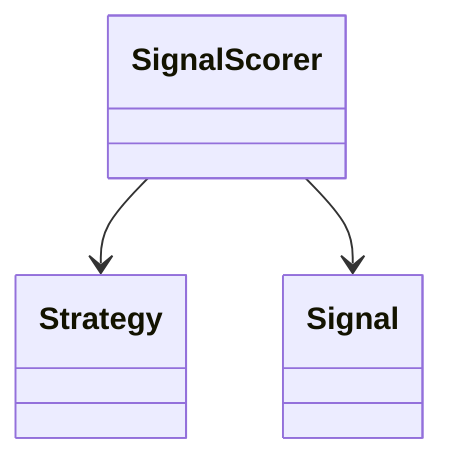

# Wiki Ingest — Source-to-Page Protocol

Reference file for `wiki` skill family. Covers: source reception, type detection, raw deposit, analysis, page generation, conflict resolution, and both interactive and batch modes.

Invoked by: the wiki agent, bob (Tier 2 integration for ADR filing), pa (Tier 3 for batch ingest).

---

## Prerequisites

Before running this protocol:

1. **Wiki resolved** — `<wiki-root>` path is known (via context detection cascade)
2. **Lock acquired** — via the canonical `wiki_lock` primitive from `~/.claude/skills/wiki/schema.md` §5.0 (POSIX `flock`, kernel-managed, trap/finally release). Never hand-roll lock logic.
3. **Schema loaded** — `<wiki-root>/WIKI.md` has been read; frontmatter conventions are known
4. **Source path known** — user provided a source path, URL, or inline content

---

## Mode Selection

### Interaction Mode

| Signal | Interaction |
|--------|------|
| User provides 1 source + "ingest this" | **Interactive** (default) |
| User provides a directory or batch of files | **Batch** |
| User explicitly passes `--batch` flag | **Batch** |
| Agent is called by bob (post-implementation ADR) | **Interactive** (single ADR at a time) |
| User pastes content inline | **Interactive** |

**Interactive** pauses at the "proceed?" step for user confirmation. **Batch** accumulates a plan and presents it once.

### Source Ownership Mode

| Mode | When | Storage | Update Tracking |
|------|------|---------|-----------------|
| **Owned** (default) | Ad-hoc ingestion of papers, articles, exports | Copied to `<wiki-root>/raw/` (immutable) | None — source is frozen at ingest time |
| **Linked** | Project-bound wikis tracking live source files | Original path retained, NOT copied | Hash + mtime stored in `_maintenance/source-tracking.yaml` |

**When to use linked mode:**
- Wiki tracks source files that live in active project repositories (e.g., trading projects, codebases, documentation sites)
- Source files will continue to evolve and the wiki must reflect updates
- Disk space matters (don't double-store large source trees)
- User explicitly says "scan this directory" or wiki has `source_roots:` configured in WIKI.md

**When to use owned mode:**
- Source is a one-time deposit (PDF paper, web clip, screenshot)
- Source needs guaranteed preservation (legal, archival, evidence)
- Source is small and external to any active project

**Hybrid is allowed**: a single wiki can have both owned (in `raw/`) and linked sources (tracked in `_maintenance/source-tracking.yaml`). The frontmatter `sources:` list in each wiki page identifies which mode applies per source.

---

## The 10-Step Ingest Flow

### Step 1: Source Reception

Confirm:
- **Path or content**: absolute path OR inline markdown/text
- **Declared type** (optional): user may say "this is a PDF" — use it as a hint
- **Destination wiki**: from context detection

If inline content: write to a temp file first at `$(mktemp -d /tmp/wiki-ingest-XXXXXX)/<slug>.md`, then proceed as if it were a file.

### Step 2: Type Detection

Detection cascade:

1. **Extension** — `.md`, `.pdf`, `.png`, `.csv`, `.json`, `.txt`, `.py`, etc.
2. **Magic bytes** (fallback via `file` command): PDF `%PDF`, PNG `\x89PNG`, etc.
3. **Content heuristic** — for ambiguous extensions: YAML frontmatter -> markdown; `{` at start -> json; tabular -> csv
4. **User confirmation** for ambiguous cases

Map to source type table (wiki agent Source Type Routing):

| Type | Handler | Multimodal? |
|------|---------|-------------|
| markdown | Read | no |
| pdf | Read (pages param) | yes (text only) |
| image | Read | yes |
| csv / tsv | Read or large-file-analysis | no |
| json / jsonl | Read | no |
| plain text | Read | no |
| code | Read | no |

### Step 3: Source Deposit (Owned) OR Source Linking (Linked)

**Branch on ownership mode** (determined in Mode Selection):

#### 3a: Owned Mode — Copy to Raw Layer (Immutable)

**Target path**: `<wiki-root>/raw/<YYYY-MM-DD>-<slug>.<ext>`

**Slug derivation:**
- Markdown/text: filename stem, lowercased, non-alphanumeric -> `-`
- PDF with metadata: `<first-author-year>` or `<title-slug>`
- Image: filename stem
- Override: user can provide `--slug=<custom>`

**Collision rule** (CRITICAL):

```
If target file already exists:
  - Append numeric suffix: <YYYY-MM-DD>-<slug>-2.<ext>
  - If -2 exists, try -3, -4, ...
  - NEVER modify or overwrite an existing raw file
  - Log the collision to log.md:
    "collision: <original> already existed, saved as <new-path>"
```

**Image attachments** for a markdown source go to `raw/images/<YYYY-MM-DD>-<slug>-<N>.<ext>` and are referenced by the corresponding wiki page.

#### 3b: Linked Mode — Track Without Copying

**No file copy.** Instead, register the source in `<wiki-root>/_maintenance/source-tracking.yaml` using the canonical **three-field identity model** from `schema.md §5.6.6`: `source_id` (lineage handle) + `content_id` (fingerprint, always derived from `sha256`) + `sha256` (ground truth).

```yaml
# _maintenance/source-tracking.yaml
version: 1
source_roots:
  - path: /path/to/projects/trading
    label: trading
    last_scanned: 2026-04-07T14:32:00Z
  - path: /path/to/projects/trading02
    label: trading02
    last_scanned: 2026-04-07T14:32:00Z

linked_sources:
  # Canonical file entry — see schema.md §5.6.6 (three-field identity) and §5.12 (source types)
  - source_id: trading/PROJECT.md                  # lineage handle, stable across re-ingestion
    content_id: 07e9e2d3d031a668                   # fingerprint, ALWAYS sha256[:16], never hand-set
    sha256: 07e9e2d3d031a66896d001f70beb384051cdbdc2e25db63cd13cf4d249a4e722
    type: file                                     # file | aggregate (§5.12)
    abs_path: /path/to/projects/trading/PROJECT.md
    source_root: trading
    rel_path: PROJECT.md
    size_bytes: 6800
    mtime: 2026-03-31T09:23:57+00:00
    lifecycle_state: active                        # active | deprecated | archived (§5.11)
    freshness: current                             # current | stale | missing | conflict (§5.11)
    ingested_at: 2026-04-07T14:32:00Z
    last_verified_at: 2026-04-07T14:32:00Z
    wiki_pages:
      - wiki/architecture/trading-system-overview.md
      - wiki/components/trading-engine.md
```

**Hashing**: use SHA-256 via `sha256sum <file>` or Python `hashlib.sha256(open(f,'rb').read()).hexdigest()`. The **full 64-char hex** is `sha256`; the first 16 hex is `content_id`. These MUST stay in lockstep — recompute `content_id = sha256[:16]` as a mandatory trailing step on every write. Lint Check 11 fails if they drift.

**Three-field identity rules** (see schema.md §5.6.6):
- `source_id` — `<source-root-label>/<relative-path>`, stable across re-ingestion at the same path
- `content_id` — `sha256[:16]`, stable across pure renames (same bytes, different path)
- `sha256` — full `hashlib.sha256(content).hexdigest()`, byte-for-byte identity

**Do NOT** use the legacy `id:` field name — it was ambiguous. Use `source_id:` throughout.

**Lifecycle vs freshness** (see schema.md §5.11): `lifecycle_state` is the persistent state (active/deprecated/archived) set by user operations. `freshness` is the health check result (current/stale/missing/conflict) computed by refresh and reported by lint. Both fields are REQUIRED on every entry.

**Citation format for linked sources**:
- In wiki page body: `[Source: trading/docs/SYSTEM-FLOW.md, lines 12-45]`
- Resolves via source-tracking.yaml lookup (label → abs_path)
- If file is moved/deleted, lint flags as `missing` and citation still resolves to last known content via wiki page

**Multi-source-root scanning** (batch mode + linked):

When user says "scan trading* folders" or wiki has `source_roots:` in WIKI.md:

1. Read `source_roots` from `_maintenance/source-tracking.yaml` (or take from user CLI)
2. For each root: walk the directory tree
3. Filter by extension (default: `*.md`, `*.py`, `*.sql`, `*.yml`, `*.yaml`, `*.toml`) — configurable per wiki
4. Skip ignored paths (`.git/`, `node_modules/`, `__pycache__/`, `.venv/`, etc.)
5. For each file: hash + mtime, check if already in source-tracking.yaml
6. Build the batch ingest plan (only NEW or MODIFIED files since last scan)
7. Present plan to user before proceeding to Step 4

**.wikiignore file** (optional, in source root): standard gitignore syntax to exclude paths from scanning.

### Step 4: Source Analysis

Type-specific extraction:

**Markdown/text:**
- Title (first H1 or filename if no H1)
- All H2/H3 headers (used for section structure)
- Entity mentions (capitalized nouns, terms in backticks, `[[links]]`)
- Date references
- Lists and tables
- Code blocks (language-tagged)

**PDF:**
- Title (from metadata or first page)
- Authors (from metadata or first page)
- Section headers (read pages in batches of 20)
- Figures (note location, extract captions)
- Abstract/summary (pages 1-2)
- References section (last pages)
- For papers >20 pages: multi-pass, summarize section-by-section, aggregate

**Image:**
- OCR any visible text
- Visual description (what's in the image)
- Diagram detection: if architecture/flow diagram, generate equivalent Mermaid for the wiki page body

**CSV/TSV:**
- Column list + types (inferred from first 100 rows)
- Row count (via `wc -l`)
- Sample rows (first 3, last 3, 3 random)
- Basic stats for numeric columns (min/max/mean/null count)
- Reconnaissance pattern — NEVER read entire large CSVs into context

**JSON/JSONL:**
- Top-level structure (array? object?)
- Schema of first element
- Array length (JSONL: line count)

**Code (structural extraction only — wiki captures synthesis, not code mirror):**

For `.py`, `.js`, `.ts`, `.go`, `.rs`, `.java`, `.sql`, `.yml`, `.yaml`, `.toml`:

| Field | Python | JS/TS | SQL | YAML/TOML |
|-------|--------|-------|-----|-----------|
| Module/file purpose | Module docstring (top of file) | Top JSDoc / comment block | Header comment | File-level comment |
| Exports / public API | Top-level `def`, `class`, `__all__` | `export` statements, exported classes/functions | `CREATE TABLE`, `CREATE FUNCTION`, `CREATE VIEW` names | Top-level keys |
| Function signatures | `def name(args) -> return:` lines | `function name(args)` / arrow functions | Function name + parameter list | n/a |
| Class hierarchy | `class Name(Parent):` | `class Name extends Parent` | n/a | n/a |
| Docstrings | Function/class docstrings (first line + extended) | JSDoc blocks | Comment blocks above objects | Comment blocks above sections |
| Dependencies | `import` / `from X import` | `import` / `require` | `REFERENCES`, foreign keys | `extends`, `include`, `depends_on` |
| LOC (lines of code) | `wc -l` | `wc -l` | `wc -l` | `wc -l` |
| Side effects | `if __name__ == '__main__':` blocks, top-level execution | Top-level statements outside functions | n/a | n/a |

**Extraction rules:**
- **NEVER** include full function bodies — only signatures + docstrings
- **DO** capture cross-references (which modules import which) — feeds wiki cross-linking
- **DO** capture file-level structure (a class diagram per module is valuable Mermaid output)
- **CAP** structural summary at ~200 lines per source file (truncate with note if larger)
- For very large files (>2000 lines): use `large-file-analysis` patterns — read in chunks, accumulate to temp file

**Source-tracking entry** (linked mode, code):

Code ingested as **individual files** uses `type: file` (see schema.md §5.6.6). Code ingested as a **whole directory / module** (typical for large code bases where structural summary is more valuable than per-file tracking) uses `type: aggregate` with the canonical aggregate hash recipe from schema.md §5.12:

```yaml
# type: file — single code file
- source_id: trading/src/trading_engine/scoring.py
  content_id: <sha256[:16]>                  # ALWAYS derived, never hand-set
  sha256: <full 64-char>
  type: file
  abs_path: /path/to/projects/trading/src/trading_engine/scoring.py
  ...

# type: aggregate — directory of code (canonical recipe, §5.12)
- source_id: trading/src/trading_engine
  content_id: <aggregate_sha256[:16]>        # ALWAYS derived from aggregate_sha256
  aggregate_sha256: <full 64-char>           # computed via: find | sort | xargs sha256sum | sha256sum
  type: aggregate
  abs_path: /path/to/projects/trading/src/trading_engine
  aggregate_glob: "*.py"
  aggregate_exclude: ["__pycache__", "__init__.py"]
  total_bytes: 247891                        # REQUIRED: sum of file sizes matching glob
  file_count: 23                             # REQUIRED: count of files matching glob
  latest_mtime: 2026-04-05T00:51:44+00:00
  lifecycle_state: active
  freshness: current
```

**CRITICAL**: for aggregates, `content_id` MUST equal `aggregate_sha256[:16]` — never a truncated display string (e.g. `e905cbed8f2c...` with trailing dots is a bug). Lint Check 11 will fail on mismatch.

**Generated wiki page format for code sources:**

```markdown
---
type: component  # or module, library
title: "Module: trading_engine.scoring"
slug: trading-engine-scoring
sources:
  - source_id: trading/src/trading_engine/scoring.py
    content_id: <sha256[:16]>
    mode: linked
tags: [code/python, trading-engine]
---

# Module: trading_engine.scoring

**Purpose**: [from module docstring]
**File**: `trading/src/trading_engine/scoring.py` (847 LOC)

## Public API

| Symbol | Type | Signature | Purpose |
|--------|------|-----------|---------|
| `SignalScorer` | class | `class SignalScorer:` | Main scoring engine |
| `score_signal` | method | `def score_signal(signal: Signal) -> float:` | Computes weighted score |

## Dependencies

- [[trading-engine-strategies]] — strategy plugins
- [[shared-config]] — configuration loading
- External: `numpy`, `pandas`, `pydantic`

## Class Diagram



## See Also
- [[trading-engine-overview]]
```

### Step 5: Discuss With User (Interactive Mode Only)

Present a **compact proposal** (under 400 words):

```
Source analyzed: raw/2026-04-07-vaswani-2017.pdf
Type: PDF, 15 pages
Detected: paper (research template)

Proposed pages:
  1. paper-summary: vaswani-2017-attention (new)
  2. concept: self-attention (new)
  3. concept: multi-head-attention (new)

Existing pages potentially affected:
  - transformers (adding backlink)
  - sequence-modeling (adding backlink)

Proceed? (y / edit / skip / more details)
```

**User responses:**
- `y` / `yes` / `proceed` -> continue to Step 6
- `edit` -> user modifies the proposal inline
- `skip` -> remove the named page(s) from the plan
- `more details` -> show extracted content for each proposed page
- `no` / `cancel` -> abort, release lock, keep raw/ file

**Batch mode**: Skip this step per source. Accumulate all proposals, present once at Step 5-batch at the end.

### Step 6: Conflict Detection

For each proposed page:

1. **Does a page with this slug already exist?**
   - YES -> load existing page, compare claims against new source
   - NO -> no conflict, new page

2. **Does the new content contradict existing claims?**
   Extract key claims from new source, grep for related pages, compare.

3. **Apply conflict resolution protocol:**

| Scenario | Action |
|----------|--------|
| New source is newer + **same authority** (same author, updated paper) | **SUPERSEDES**: update existing wiki page, move old content to History section, add `supersedes: [old-source-path]` |
| New source is newer + **different authority** (different paper on same topic) | **AUGMENTS**: both claims kept with attribution, frontmatter `augmented_by: [...]` |
| Same date, different claims | **CONTRADICTS**: frontmatter flag `contradicts: [<page-slug>]` on BOTH pages, body includes both claims with sources |
| New source confirms existing claim | **REINFORCES**: append source to `sources` list, no content change |

4. **Flag to user in interactive mode** if conflict severity is high:

```
Conflict detected on [[self-attention]]:
  Existing claim (from raw/2023-06-01-paper-a.pdf): "Attention scales linearly"
  New claim (from raw/2026-04-07-vaswani-2017.pdf): "Attention scales quadratically"

Resolution options:
  1. SUPERSEDES — new paper is authoritative, update existing page
  2. AUGMENTS — add as alternative perspective, keep both
  3. CONTRADICTS — flag as open contradiction, both visible

Choose (1/2/3): _
```

### Step 7: Page Generation

For each approved page, generate the markdown file:

**Structure:**
1. **Frontmatter** — follow domain template schema from WIKI.md (see schema.md Part 3)
2. **H1 title**
3. **Summary paragraph** (1-3 sentences) with inline citation
4. **Key sections** derived from source (H2 level)
5. **Citations inline** — every factual claim ends with `[Source: raw/<file>, p.<N>]` or `[Source: raw/<file>, lines <start>-<end>]`
6. **See Also** section with wikilinks to related pages

**Frontmatter generation:**
- `type`: from proposal decision
- `title`: extracted from source or user-provided
- `slug`: kebab-case, must match filename
- `created` / `updated`: today's date
- `sources`: list including at least this ingest's raw file
- `tags`: from source hints (extracted entities, domain taxonomy)
- `status`: `draft` if uncertain extraction, `active` if confident
- `confidence`: based on source quality (peer-reviewed=high, blog=medium, unsourced=low)
- `related`: wikilinks to sibling pages (cross-link step handles reverse links)

**Write the page:**
- Path: `<wiki-root>/wiki/<category>/<slug>.md`
- Category from page type -> directory mapping in WIKI.md

**Citation format reminder:**
```
The Transformer architecture replaces recurrence with self-attention [Source: raw/2026-04-07-vaswani-2017.pdf, p.1].
```

Never write a factual statement without a citation. Structural sentences ("This page covers X") don't need citations; claims do.

### Step 8: Cross-Reference Creation (Bidirectional)

For each newly generated page:

1. **Outgoing links** are already in the page body (from Step 7 See Also + inline wikilinks)
2. **Incoming links (backlinks)**: scan other pages for:
   - Mentions of the new page's title
   - Mentions of any `aliases` value
   - Direct `[[slug]]` that previously had no target

3. **Auto-link scan** (respect the auto-linking rules in WIKI.md):
   - For each existing page mentioning the new title, insert a wikilink on the first mention
   - Batch these edits — do not lint between each
   - NEVER auto-link inside code blocks, quoted blocks, or `_templates/`/`_maintenance/`

4. **Update `_maintenance/link-index.md`** with outgoing + incoming entries for the new page

**Interactive mode**: confirm auto-link backfill if it touches >5 pages.

### Step 9: Update `index.md`

Append new page entries to the relevant category section of index.md:

```markdown
## Papers

- [[vaswani-2017-attention]] — "Attention Is All You Need" (Vaswani et al., 2017) — the Transformer paper
```

**Format** (per WIKI.md convention): `- [[slug]] — "<title>" (<brief hint>) — <short description>`

If a new category section is needed (first page of that type), create the H2 header.

### Step 9b: Append Page Events

For each page created or updated in this ingest, append a line to `_maintenance/page-events.jsonl`:

```jsonl
{"ts":"<ISO8601>","page":"<wiki/path/page.md>","event":"create","wiki_version":<NN>,"source_id":"<source-id>","trigger":"ingest"}
```

For updates: `event:"update"`, add `"fields_changed":["body","sources",...]`. For renames: `event:"rename"`, add `"old_slug":"..."`. See `schema.md` Part 5.5 for full event taxonomy.

### Step 9c: Bump wiki_version + Commit + Tag (TRANSACTIONAL)

This step is the transaction boundary. **Use the canonical `wiki_transaction` protocol from `schema.md` §5.9.** Never hand-roll `HEAD~1` rollback or per-step error handling. The same atomicity rules that apply to refresh apply to ingest.

**Canonical pattern** (see schema.md §5.0 for `wiki_lock`, §5.9 for `wiki_rollback_to`, §5.6.5 for `wiki_latest_version`):

```bash
wiki_ingest_commit() {
  local wiki_root=$1
  local batch_summary=$2
  local pages_count=$3

  # Step 1: Acquire lock (kernel-managed, auto-release via trap)
  wiki_lock "$wiki_root" "ingest" || return 1

  cd "$wiki_root" || return 1

  # Step 2: Record starting commit BEFORE any mutations this transaction will commit
  local START_COMMIT
  START_COMMIT=$(git rev-parse HEAD) || return 1

  # Step 3: Compute new version via merged-HEAD discovery (§5.6.5)
  local LAST_N NEW_N NEW_TAG
  LAST_N=$(wiki_latest_version)
  LAST_N=${LAST_N:--1}
  NEW_N=$((LAST_N + 1))
  printf -v NEW_TAG "wiki-v%02d" "$NEW_N"

  # Step 4: Bump WIKI.md wiki_version (mutation)
  bump_wiki_version "$wiki_root" "$NEW_N" || {
    wiki_rollback_to "$START_COMMIT"
    return 1
  }

  # Step 5: Append wiki-metrics.jsonl snapshot (envelope already present, or added by bootstrap)
  append_wiki_metrics "$wiki_root" "ingest_batch" "$pages_count" || {
    wiki_rollback_to "$START_COMMIT"
    return 1
  }

  # Step 6: Verify working tree changes are the expected set (safety check)
  if [ -z "$(git status --porcelain)" ]; then
    echo "No changes to commit — aborting" >&2
    wiki_rollback_to "$START_COMMIT"
    return 1
  fi

  # Step 7: Commit (atomic via git)
  git add -A || { wiki_rollback_to "$START_COMMIT"; return 1; }
  git commit -m "$NEW_TAG: ingest $batch_summary ($pages_count pages)" || {
    wiki_rollback_to "$START_COMMIT"
    return 1
  }

  # Step 8: Tag (on any failure, roll back the commit we just made via $START_COMMIT)
  if ! git tag "$NEW_TAG"; then
    wiki_rollback_to "$START_COMMIT"
    return 1
  fi

  # Step 9: Verify tag matches WIKI.md wiki_version — EXACT match, no tolerance (§5.6.5)
  local stored_version
  stored_version=$(grep '^wiki_version:' WIKI.md | awk '{print $2}')
  if [ "$stored_version" != "$NEW_N" ]; then
    echo "Version mismatch after commit — rolling back" >&2
    wiki_rollback_to "$START_COMMIT"
    return 1
  fi

  echo "ingest complete: $NEW_TAG ($pages_count pages)"
  return 0
  # Lock released automatically by wiki_lock's trap on normal return
}
```

**Key invariants enforced by this pattern**:
- **Every** error path calls `wiki_rollback_to "$START_COMMIT"` — NEVER `HEAD~1`. A failing refresh that never commits will simply re-point HEAD to itself (no-op, safe).
- **Every** rollback includes `git clean -fd` (baked into `wiki_rollback_to`).
- **Lock released on every exit path** via the `trap EXIT INT TERM` installed by `wiki_lock` (§5.0).
- **Version discovery** uses `git tag --merged HEAD` (§5.6.5) — stray tags on orphan branches cannot hijack.
- **Tag ↔ WIKI.md exact match**, no ±1 tolerance (§5.6.5).

**Non-git fallback**: If git is unavailable, the wiki has no transactional guarantees. Write a snapshot to `_maintenance/snapshots/v<NN>/` and warn. Document this as a degraded mode in the wiki's `.wiki-meta.yaml`. See schema.md §5.8.

### Step 9d: Append Wiki Metrics

Append to `_maintenance/wiki-metrics.jsonl`:

```jsonl
{"ts":"<ISO8601>","event":"ingest_batch","wiki_version":<NN>,"page_count":<total>,"source_count":<total>,"link_count":<total>,"sources_added":<N>,"pages_added":<N>,"pages_updated":<N>,"duration_s":<N>}
```

For interactive single-page ingests, use `"event":"ingest_single"` and only bump the wiki_version when the user explicitly requests it (so single-source ingests don't spam version bumps).

### Step 10: Log the Operation

Append to `<wiki-root>/log.md`:

```markdown
## 2026-04-07T14:32:00Z — INGEST (interactive)

Source: raw/2026-04-07-vaswani-2017.pdf (15 pages, pdf)
Pages created:
  - wiki/papers/vaswani-2017-attention.md
  - wiki/concepts/self-attention.md
  - wiki/concepts/multi-head-attention.md
Pages modified (backlinks):
  - wiki/concepts/transformers.md (added backlink)
Conflicts resolved: 0
Lint triggered: interactive mode, skipped
Duration: 47s
Agent: wiki
```

---

## Batch Mode Specifics

Batch mode processes multiple sources in one operation:

### Refresh Mode (Discovery → Re-Ingest)

**What it is**: Batch re-ingest of linked sources whose content has changed since last ingest. Triggered by user (`"refresh trading wiki"`), by session-start discovery, or by lint Check 11 with `--refresh`.

**Why it's separate from a normal batch ingest**: Refresh only touches sources that were already known to the wiki. It doesn't add new sources (use a normal batch ingest with directory scan for that). Refresh is the answer to "wiki, my source files changed, update yourself."

#### Refresh Protocol

**Canonical implementation**: `wiki_refresh` in `schema.md §5.9`. Read that function verbatim — this section describes the user-visible steps; the atomicity and rollback details live in schema.md.

```
1. Acquire lock via wiki_lock (schema.md §5.0) — trap installed for auto-release
2. Record START_COMMIT = $(git rev-parse HEAD)
3. Pre-check: working tree must be clean (git diff --quiet HEAD && git status --porcelain empty).
   If dirty → abort (lock released by trap).
4. Read _maintenance/source-tracking.yaml
5. Run Check 11 (full hash mode, by type — see schema.md §5.12):
   For each entry in linked_sources:
     - Verify file/directory exists at abs_path
     - If type=file: compute current SHA-256 of the file
     - If type=aggregate: recompute aggregate hash via verify_aggregate()
     - Compare against stored sha256 / aggregate_sha256
     - Derive freshness: current | stale | missing | conflict
6. Build refresh plan (one entry per stale source):
   stale_sources = [
     {source_id, abs_path, type, old_sha, new_sha, wiki_pages}
     for source in linked_sources if freshness == 'stale'
   ]
7. Present plan to user (batch approval or per-source).

8. For each approved stale source — any failure calls wiki_rollback_to "$START_COMMIT":
   a. Re-run Step 4 (Source Analysis) with the NEW content
   b. Re-generate or update the affected wiki pages
      - Treat as UPDATE, not CREATE
      - Preserve frontmatter `created` date; bump `updated` to today
      - Re-extract claims, re-cite, re-link
      - If contradiction with prior version: inline "[Updated from previous version: was X, now Y]"
   c. Update source-tracking.yaml entry (three-field identity, §5.6.6):
      - sha256 (or aggregate_sha256) = new value
      - content_id = sha256[:16]  # ALWAYS derived, same write
      - mtime (or latest_mtime) = new value
      - ingested_at = now
      - last_verified_at = now
      - freshness = 'current'      # §5.11 canonical name
      - lifecycle_state unchanged   # refresh does NOT touch lifecycle_state
   d. Append page-events.jsonl entry per affected page:
      {"ts":"...","event":"update","trigger":"refresh","fields_changed":[...]}
      (envelope must already exist; refresh does not prepend one)

9. For sources marked 'missing' (file deleted):
   - Do NOT auto-delete the wiki page
   - Set freshness = 'missing' in source-tracking.yaml
   - Add to lint report as a Failure on next lint run
   - Offer to deprecate via the source removal protocol (schema.md §5.4)

10. After all refreshes complete (still inside lock):
    a. Rebuild _maintenance/content-index.yaml from the updated source-tracking.yaml
       (map content_id → [source_ids], cheap rename-scan index — see schema.md §5.6.6)
    b. Append wiki-metrics.jsonl snapshot:
       {"ts":"...","event":"refresh_batch","wiki_version":NN,"sources_refreshed":N,"pages_updated":M,...}
    c. Append log.md entry
    d. Compute NEW_N via wiki_latest_version() + 1  (§5.6.5, merged-HEAD discovery)
    e. Bump WIKI.md wiki_version to NEW_N
    f. git add -A && git commit -m "wiki-vNN: refresh (...)" — on failure, wiki_rollback_to
    g. git tag wiki-vNN — on failure, wiki_rollback_to
    h. Verify tag matches WIKI.md EXACTLY (§5.6.5, no tolerance) — on mismatch, wiki_rollback_to

11. Run lint to verify (read-only; Check 11 should now report 0 stale)

12. Lock released automatically by wiki_lock's trap (§5.0) — no explicit release needed
```

**Rollback invariants** (all from schema.md §5.9):
- EVERY error path calls `wiki_rollback_to "$START_COMMIT"` — NEVER `git reset --hard HEAD~1`.
- `wiki_rollback_to` runs `git reset --hard $START_COMMIT && git clean -fd` — untracked files from the failed transaction are removed.
- If the refresh fails BEFORE any commit was made, `wiki_rollback_to "$START_COMMIT"` is a no-op reset to the same commit — safe, idempotent.
- The lock is released on every exit path (success, error, signal, crash) via the trap installed in `wiki_lock`.

#### Discovery Stages (When Refresh Is Triggered)

| Stage | Trigger | Behavior |
|-------|---------|----------|
| **Session start** | Wiki agent activated with wiki context | Quick mtime-only scan; report stale count; offer refresh; do NOT auto-execute |
| **Lint Check 11** | User runs lint | Full hash scan; report stale/missing; suggest refresh; lint never bumps version itself |
| **User explicit** | "refresh wiki", "update wiki from sources" | Run refresh protocol with user confirmation per source (or batch approve) |
| **Lint --fix --refresh** | User runs `lint --fix --refresh` | Run refresh after fixable lint issues are addressed |
| **Cron / scheduled** | (out of scope for v1) | Background refresh — would require dedicated scheduler |

**Key principle**: Lint is read-only. Refresh is the write operation. They are deliberately separate so lint can be run safely at any time without side effects.

### Plan Accumulation
1. Run Steps 1-4 for each source without asking user
2. Accumulate proposed pages, conflicts, and cross-references into a single plan
3. Present the plan ONCE:

```
Batch ingest plan — 12 sources

Proposed new pages: 23
Proposed page updates: 5
Detected conflicts: 3 (SUPERSEDES: 1, AUGMENTS: 2, CONTRADICTS: 0)
Cross-reference updates: ~40 backlinks

Review plan in full? (y/n) — or 'approve' to proceed
```

### Batch Execution
4. On approval, execute Steps 6-9 for each source
5. Cross-reference sweep happens AFTER all pages exist (not per-source)
6. Single consolidated log entry at Step 10

### Mandatory Lint After Batch
7. **ALWAYS** run `wiki/lint.md` protocol after a batch ingest
8. If lint reports failures, present to user, offer `--fix` for auto-fixable items

---

## Anti-Hallucination Enforcement

**Rule**: Every factual claim MUST have a citation.

**Enforcement points:**
1. Page generation (Step 7) — inline citations required
2. Lint check #3 (source traceability) — catches missing citations
3. Human review — lint flags unsourced claims in `warnings` bucket

**When a source doesn't say something:**
- Do NOT write it
- Do NOT infer it from general knowledge
- Do NOT paraphrase what "similar papers usually say"
- If the user insists, mark it as `confidence: low` and add frontmatter flag `unsourced_claim: true`

**Synthesis across sources** (Step 7 special case):
- Use `synthesis` type
- Cite ALL contributing sources in frontmatter `sources` list
- Body citations use the form `[Synthesis: source-A.pdf + source-B.pdf]` when the claim requires both
- Confidence defaults to `medium` for synthesis pages

---

## Error Handling

| Error | Action |
|-------|--------|
| Source file not found | Abort, release lock, report |
| Source type unsupported | Fall back to `general` / plain text handling, warn user |
| Raw deposit collision (after -9 suffix) | Fail loudly — this shouldn't happen in practice |
| Page generation produces invalid frontmatter | Regenerate with defaults, log warning |
| User cancels mid-flow | Release lock, keep raw/ file if copied, undo any wiki/ writes |
| Conflict resolution needs user input in batch mode | Queue conflict, continue other sources, present all conflicts at end |
| Lock held by another agent | `wiki_lock` returns nonzero with LOCK BUSY message and holder PID from `.wiki.lock.info` — abort and ask user to retry; never force-steal (kernel-managed flock makes it impossible to steal anyway) |

---

## Anti-Patterns

| Anti-Pattern | Why It Fails | Correct Approach |
|---|---|---|
| Ingesting without lock | Concurrent writes corrupt index.md | Use canonical `wiki_lock` (schema.md §5.0) before Step 3 |
| Writing pages without inline citations | Hallucination contamination, unverifiable claims | Every factual sentence gets `[Source: ...]` |
| Overwriting existing raw/ files | Breaks provenance, destroys historical sources | Collision rule: append `-2`, `-3`, ... never overwrite |
| Skipping conflict detection | Contradictory claims accumulate silently | Step 6 is mandatory — grep for existing pages before writing |
| Batch mode without final lint | Broken cross-links and missing backlinks slip through | Step 10 ALWAYS triggers lint.md for batch |
| Auto-linking inside code blocks | Breaks code examples, creates invalid wikilinks | Respect the "never in code blocks" exception in Step 8 |
